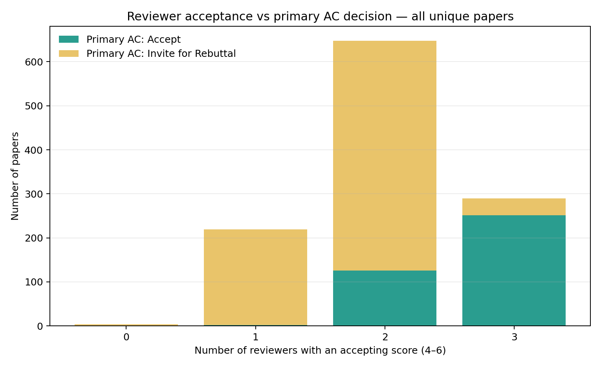

# miccai2026_foragents

This project analyzes MICCAI 2026 medical-imaging papers, with classification
and segmentation of MRI volumes as the main focus and breast MRI prioritized
for deeper analysis.

See [AGENTS.md](AGENTS.md) for repository conventions and
[docs/PROJECT_MEMORY.md](docs/PROJECT_MEMORY.md) for the current analysis state.

## Reviewer acceptance summary

The chart below summarizes the number of reviewers assigning an accepting score
(4–6) for each unique paper, together with the corresponding primary AC
decision. It highlights how AC reviewers used rebuttal invitations when the
initial reviewer consensus was weak.

An interesting pattern is the strong dependence of the AC decision on the
reviewer consensus: **99.09%** of papers with one accepting reviewer were sent
to rebuttal (**217/219**), compared with **80.56%** with two accepting reviewers
(**522/648**) and **13.45%** with three accepting reviewers (**39/290**). This
steep decline suggests a substantial human judgment factor in AC decisions:
rebuttal is used most often when reviewer support is divided, while broad
reviewer agreement usually leads directly to acceptance. These are descriptive
associations, not evidence that reviewer counts alone caused the AC decision.

Four papers received no accepting score from any reviewer, yet the primary AC
decision was **Invite for Rebuttal** for all four:

- [Anatomy- and Site-Guided 3D Patch Diffusion for Robust MRI Harmonization](https://papers.miccai.org/miccai-2026/0052-Paper3157.html)
- [BRAIN: Bi-directional Motion Reasoning with Dynamic Memory Pruning for Surgical Video Segmentation](https://papers.miccai.org/miccai-2026/0116-Paper5179.html)
- [RAPO: Risk-Aware Anatomical Prior Optimization via Reinforcement Learning for CAC Detection in Rheumatoid Arthritis](https://papers.miccai.org/miccai-2026/0855-Paper1391.html)
- [Surgical Video Temporal Grounding](https://papers.miccai.org/miccai-2026/1013-Paper4572.html)

The underlying per-paper summary is available in
[`reports/review_acceptance/acceptance_summary.csv`](reports/review_acceptance/acceptance_summary.csv).
