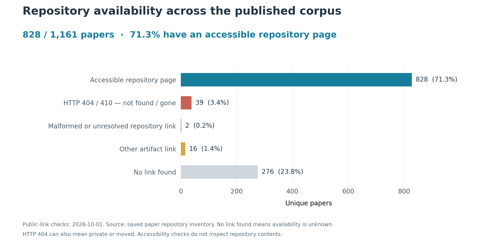
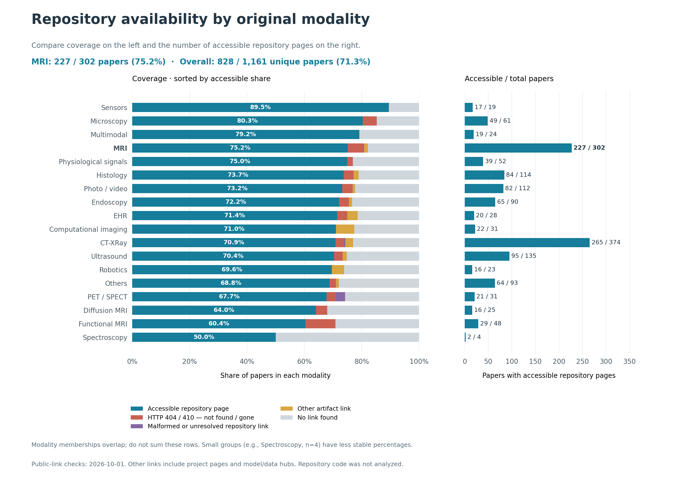
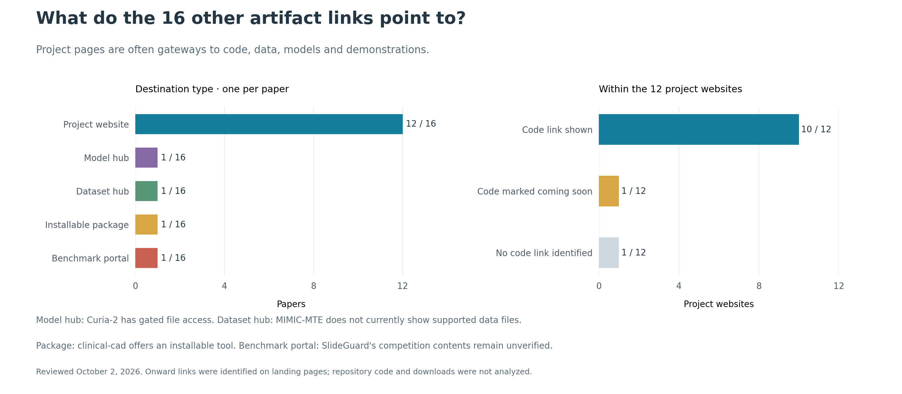

# Repository-link availability in the published-paper index

Snapshot generated: 2026-10-02T10:33:42+00:00

The local published-paper corpus contains 1,161 unique papers, identified by paper_url.
The overall denominator counts each paper once. Modality denominators reconstruct original
memberships from Published_papers/deduplication_map.csv, so multimodal papers appear in
more than one modality. Modality totals must not be added to obtain the overall total.

The code_url field supplies 853 links; abstracts supply
32 additional explicit repository URLs for papers with an empty code_url.
Original CSVs are unchanged. The inventory preserves original_code_url and link_source.

A listed code link is a declaration, not proof of released source code. Repository-host links
include GitHub, GitLab, and anonymous.4open.science. Other links include project pages,
model/dataset hubs, a package index, and a benchmark platform. No listed link means unknown
code availability, not confirmed absence of code. Project pages can lead to additional repositories.

Live checks, when requested, test public HTTP accessibility only. A successful page response
does not establish that a repository contains implementation files or reproduces the paper.
404/410 means the listed URL is not publicly accessible; it does not distinguish a private
repository from a missing one. Network errors, authentication, and rate limits remain unresolved.

## Visual summary





[Overall chart (SVG)](overall_availability.svg) · [Modality chart (SVG)](availability_by_modality.svg)

## Other artifact links



The 16 links comprise 12 project websites, one model hub, one dataset hub,
one installable package, and one benchmark portal. Ten project websites display
onward code links; one marks code as coming soon; one has no code-labelled link identified.
These are landing-page observations, not newly verified repository releases.

[Curia-2](https://huggingface.co/raidium/curia-2) requires accepting conditions for model-file access.
[MIMIC-MTE](https://huggingface.co/datasets/wanqi16/MIMIC-MTE) has an empty card and no supported data files detected by its viewer.
[clinical-cad](https://pypi.org/project/clinical-cad/) provides package installation instructions.
The SlideGuard Codabench URL is classified by platform; competition contents could not be verified.

See [per-paper classifications and evidence](other_artifact_details.csv).
The original availability snapshot and its counts are unchanged.

## Original modality memberships

| Modality | Papers | Listed code links | Link rate | Repository-host links | Repo-link rate | Accessible repo pages | Other links | No link |
|---|---:|---:|---:|---:|---:|---:|---:|---:|
| Overall (unique papers) | 1161 | 885 | 76.23% | 869 | 74.85% | 828 | 16 | 276 |
| CT-XRay | 374 | 288 | 77.01% | 278 | 74.33% | 265 | 10 | 86 |
| Computational_imagings | 31 | 24 | 77.42% | 22 | 70.97% | 22 | 2 | 7 |
| Diffusion-MRI | 25 | 17 | 68.00% | 17 | 68.00% | 16 | 0 | 8 |
| EHR | 28 | 22 | 78.57% | 21 | 75.00% | 20 | 1 | 6 |
| Endoscopy | 90 | 69 | 76.67% | 68 | 75.56% | 65 | 1 | 21 |
| Func_MRI | 48 | 34 | 70.83% | 34 | 70.83% | 29 | 0 | 14 |
| Histology | 114 | 90 | 78.95% | 88 | 77.19% | 84 | 2 | 24 |
| MRI | 302 | 248 | 82.12% | 244 | 80.79% | 227 | 4 | 54 |
| Microscopy | 61 | 52 | 85.25% | 52 | 85.25% | 49 | 0 | 9 |
| Multimodals | 24 | 19 | 79.17% | 19 | 79.17% | 19 | 0 | 5 |
| Others | 93 | 67 | 72.04% | 66 | 70.97% | 64 | 1 | 26 |
| PET_SPECT | 31 | 23 | 74.19% | 23 | 74.19% | 21 | 0 | 8 |
| Photo_video | 112 | 87 | 77.68% | 86 | 76.79% | 82 | 1 | 25 |
| Physio-signals | 52 | 40 | 76.92% | 40 | 76.92% | 39 | 0 | 12 |
| Robotics | 23 | 17 | 73.91% | 16 | 69.57% | 16 | 1 | 6 |
| Sensors | 19 | 17 | 89.47% | 17 | 89.47% | 17 | 0 | 2 |
| Spectroscopy | 4 | 2 | 50.00% | 2 | 50.00% | 2 | 0 | 2 |
| ultrasounds | 135 | 101 | 74.81% | 99 | 73.33% | 95 | 2 | 34 |

## Link types

- repository_host_link: 863
- no_listed_link: 276
- project_page: 12
- anonymous_repository_link: 6
- model_or_dataset_hub: 2
- package_index: 1
- benchmark_platform: 1

## Public accessibility checks

- accessible: 844
- no_listed_link: 276
- not_publicly_accessible: 39
- invalid_url: 2

## Cohort interpretation

Use published-paper membership as the corpus definition. Do not filter on meta_final_decision:
that field stores the last extracted AC recommendation, which is not necessarily the
conference's final publication decision. The local review data includes Reject recommendations
for papers present on the official accepted-version open-access site.

Official example checked on 2026-10-01:
https://papers.miccai.org/miccai-2026/0078-Paper2030.html
The site's introduction identifies its contents as accepted versions; the same page contains
a rejecting AC recommendation. This confirms that review recommendations are an unsuitable filter.

## Regeneration

```bash
make report
# Optional live public HTTP checks (no cloning, PDF downloads, or code execution):
python3 -m src.repository_availability --check-links
```
